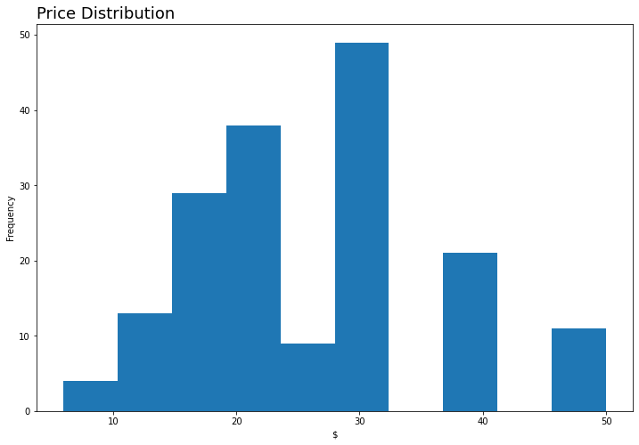
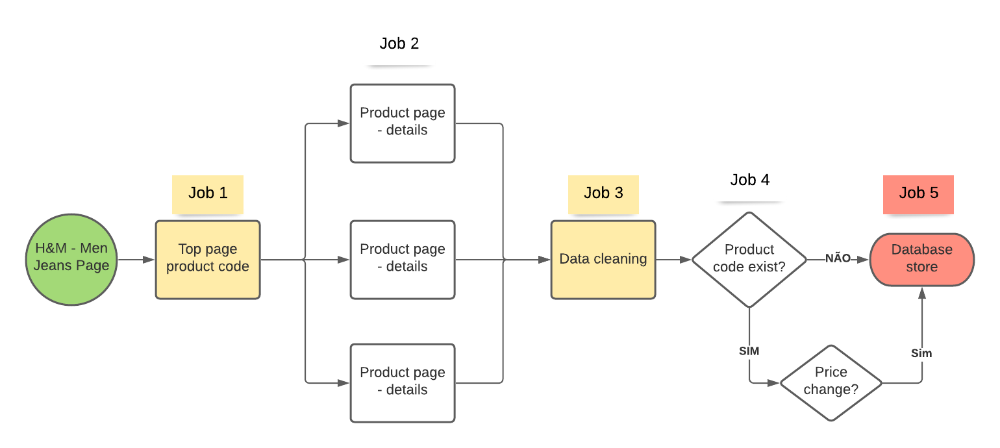

# Benchmarking USA men's jeans prices 

## 1 Business Challenge
Definition of pricing strategy for entry into the American men's jeans market.

## 2 Business Assumptions
1. Pricing strategy can be defined based on the price of leading companies. 
2. H&M is a reference company in the market 

## 3 Solution Strategy
Collect men's jeans prices and product details from the H&M company webpage via web scraping.

## 4 Top 3 Data Insights
### 1 Price distributions are approximately normal around the mean

 

### 2 The average price is $26.13, with $10.40 of fluctuation. 

 

### 3 Skinny Jeans and Slim Jeans represent 51% of the items.

 

## 5 H&M Data Collection
### 5.1 ETL Architecture Design 

## 6 Lessons Learned

The collection of data from all the products available on the web page is not viable, since the error of maximum attempts exceeds is obtained, probably the site blocks requests to URLs identified as made by a machine.

## 7 Next Steps to Improve
1. Use a cloud solution to execute the jobs automatically. 
2. Change ETL architecture to asynchronous model to avoid max retries exceeded error.
